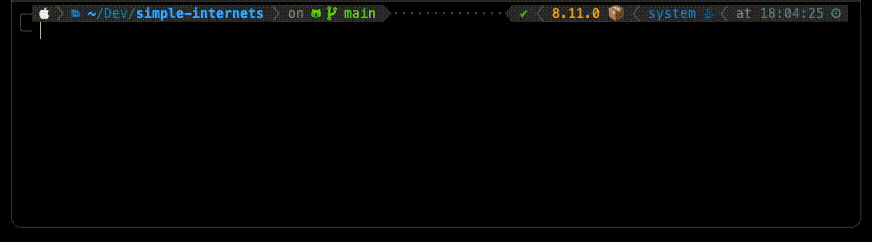

# Simple Internets

Simple Internets is an open-source tool designed to provide a comprehensive yet user-friendly way to test internet speeds. This Python-based tool leverages the power of multithreading to maximize bandwidth usage during tests, ensuring accurate measurements especially for high-speed connections.



## Features

- **Concurrent Testing**: Utilizes multiple threads to simultaneously conduct speed tests, maximizing bandwidth usage.
- **Customizable Intervals**: Users can set the time interval between each test run.
- **User-Friendly Output**: Features colored CLI output and progress indicators for easy understanding of test results.
- **Detailed Logging**: Each test result is logged with details like download and upload speeds, timestamp, and more.

## Getting Started

### Prerequisites

- Python ^3.11
- Poetry (Python dependency manager)

### Installation

1.  Clone the repository:

```bash
git clone https://github.com/open-octave/simple-internets.git
```

2.  Navigate to the cloned repository:

```bash
cd simple-internets
```

3.  Install dependencies using poetry:

```bash
poetry install
```

### Usage

Run the script from the command line:

```bash
poetry run python simple_internets/main.py
```

Optional arguments:

- `-i`, `--interval`: Interval between tests in seconds (default: 180).
- `-t`, `--threads`: Number of concurrent threads for the test (default: 1).

Example:

```bash
poetry run python simple_internets/main.py --interval 10 --threads 2
```

## Contributing

Contributions are what make the open-source community such an amazing place to learn, inspire, and create. Any contributions you make are **greatly appreciated**.

1.  Fork the Project
2.  Create your Feature Branch (`git checkout -b feature/AmazingFeature`)
3.  Commit your Changes (`git commit -m 'feat(scope): add some AmazingFeature'`)
4.  Push to the Branch (`git push origin feature/AmazingFeature`)
5.  Open a Pull Request

## License

Distributed under the GNU General Public License. See `LICENSE` for more information.

## Contact

Matthew Endicott - [LinkedIn](https://www.linkedin.com/in/matthewendicott/)

Project Link: [https://github.com/open-octave/simple-internets](https://github.com/open-octave/simple-internets)
